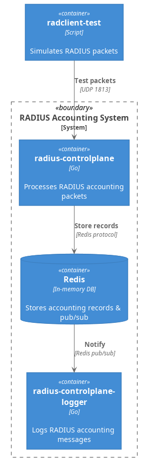

# RADIUS Accounting System

A RADIUS accounting server implementation in Go that processes RADIUS accounting packets, stores them in Redis, and provides real-time event notifications through a subscriber service.

**Version**: 2.0.0  
**Go Version**: 1.22+  

## Purpose

Monitor and collect mirrored RADIUS accounting traffic for analysis. This system is designed to receive copied RADIUS traffic for monitoring purposes (not performing authentication).

## Features

### Core Functionality
- **RFC 2866 Compliant**: Full RADIUS Accounting protocol support
- **Accounting Types**: Processes Start, Stop, and Interim-Update packets
- **Secure**: Shared secret authentication for packet verification
- **Persistent Storage**: Redis with configurable TTL
- **Real-time Events**: Redis keyspace notifications
- **Comprehensive Logging**: All accounting events logged to file

### Technical Features
- Database-agnostic storage interface
- Generic event notification system
- Graceful shutdown with signal handling
- Thread-safe operations
- Docker containerization
- Docker Compose orchestration
- **95.9% test coverage**

## Architecture



For detailed architecture diagrams, see [docs/architecture.md](docs/architecture.md).

## Quick Start

### Prerequisites
- Docker & Docker Compose
- Make (for build automation)
- Go 1.22+ (for local development only)

### Installation

1. **Clone the repository**:
```bash
git clone https://github.com/kal997/radius-accounting-server.git
cd radius-accounting-server
```

2. **Configure environment**:
```bash
cp .env.example .env
# Edit .env with your configuration
```

Required environment variables:
```bash
RADIUS_SHARED_SECRET=your-secret-key-minimum-8-chars
REDIS_HOST=redis
RECORD_TTL_HOURS=24
LOG_LEVEL=info
LOG_FILE=./radius_accounting.log
LOG_FILE_CONTAINER=/var/log/radius_updates.log
```

3. **Start the system**:
```bash
make run
```

## Usage Guide

### Service Management

```bash
# Start all services (foreground)
make run

# Start services in background
make run-detached

# Stop all services
make stop

# View logs
make logs

# Interactive testing shell
make shell
```

### Testing the System

#### Option 1: Interactive Shell (Recommended)
```bash
make shell

# Inside the container:
./main.sh  # Sends both start and stop requests

# Or manually:
radclient -x $RADIUS_SERVER:1813 acct $RADIUS_SHARED_SECRET < /requests/acct_start.txt
radclient -x $RADIUS_SERVER:1813 acct $RADIUS_SHARED_SECRET < /requests/acct_stop.txt
```

#### Option 2: Direct Docker Commands
```bash
# Send test accounting packet
docker run --rm \
  --network radius-network \
  -v ./examples:/requests \
  radclient-test \
  radclient -x radius-controlplane:1813 acct your-secret < /requests/acct_start.txt
```

### Verifying Operation

1. **Check RADIUS server logs**:
```bash
docker logs radius-controlplane
# Expected: "Stored accounting record: radius:acct:testuser:session12345:..."
```

2. **Check Redis data**:
```bash
docker exec -it redis redis-cli
> KEYS radius:acct:*
> GET radius:acct:testuser:session12345:2024-01-15T10:30:45Z
```

3. **Check subscriber logs**:
```bash
cat radius_accounting.log
# Expected: "2024-01-15 10:30:45.123456 - Received update for key: ..."
```

## Testing

The project maintains 95%+ test coverage with unit and integration tests.

### Test Commands

```bash
# Run all tests with coverage report
make test

# Unit tests only (fast, no dependencies)
make test-unit

# Integration tests only (requires Redis)
make test-integration

# Generate HTML coverage report
make coverage-html
# Then open coverage.html in browser

# Run tests with race detection
make test-race
```

### Test Structure
- **Unit Tests**: Config validation, model parsing, notification handling
- **Integration Tests**: Redis storage, file logging, end-to-end flows
- **Race Detection**: All tests run with `-race` flag for concurrency safety

## Development

### Local Development Setup

```bash
# Install dependencies
make mod-download

# Format code
make fmt

# Run linters
make lint

# Run go vet
make vet

# Pre-commit checks
make pre-commit
```

### Building from Source

```bash
# Build binaries
make build

# Build Docker images
make build-docker

# Clean build artifacts
make clean
```

### CI/CD Pipeline

```bash
# Run full CI pipeline (lint, test, build)
make ci
```

## Project Structure

```
.
├── cmd/
│   ├── radclient-test/              # Test client container
│   ├── radius-controlplane/         # Main RADIUS server
│   └── radius-controlplane-logger/  # Event subscriber service
├── internal/
│   ├── config/                      # Configuration management
│   ├── logger/                      # File logging implementation
│   ├── models/                      # Data models
│   ├── notifier/                    # Event notifications
│   └── storage/                     # Storage abstraction
├── examples/                        # Sample RADIUS packets
├── docs/                           # Architecture documentation
├── test/                           # Integration tests
├── Makefile                        # Build automation
├── docker-compose.yml              # Service orchestration
└── docker-compose.integration.yml  # Test orchestration
```


## Configuration

### Environment Variables

| Variable | Description | Default | Required |
|----------|-------------|---------|----------|
| `RADIUS_SHARED_SECRET` | RADIUS shared secret (min 8 chars) | - | Yes |
| `REDIS_HOST` | Redis hostname | - | Yes |
| `RECORD_TTL_HOURS` | TTL for Redis records in hours | - | Yes |
| `LOG_LEVEL` | Logging level (debug/info/warn/error) | - | Yes |
| `LOG_FILE` | Host path for log file | - | Yes |
| `LOG_FILE_CONTAINER` | Container path for log file | - | Yes |
| `ENV` | Environment (prod/dev) | dev | No |

### Redis Configuration

Redis runs with keyspace notifications enabled:
```redis
notify-keyspace-events KEA
```
- **K**: Keyspace events (operations on keys)
- **E**: Expired events
- **A**: All commands affecting keys

## Advanced Usage

### Custom Storage Backend

The system uses interface-based design for easy extensibility:

```go
type Storage interface {
    // Store saves an accounting event.
    Store(ctx context.Context, event AccountingEvent) error
    // HealthCheck verifies storage connectivity.
    HealthCheck(ctx context.Context) error
    // Close closes the storage connection.
    Close() error
}
```

To implement a different backend (PostgreSQL, MongoDB, etc.), simply implement this interface.

### Custom Notifier

```go
type Notifier interface {
    Subscribe(ctx context.Context, patterns []string) (<-chan StorageEvent, error)
    Unsubscribe(patterns []string) error
    HealthCheck(ctx context.Context) error
    Close() error
}
```

## Design Principles

1. **Protocol Compliance**: Always sends RADIUS response, even on storage failure
2. **Graceful Degradation**: System remains operational if non-critical components fail
3. **Interface Segregation**: Clean interfaces for storage and notifications
4. **Context Propagation**: Proper cancellation and timeout handling

## Performance Characteristics

- **Buffered Channels**: 100-item buffers prevent blocking
- **Automatic Cleanup**: Redis TTL prevents unbounded growth
- **Disk Durability**: Logs synced to disk after each write
- **Concurrent Safe**: Race-condition free implementation

## Security Considerations

- Minimum 8-character shared secret requirement
- All packets validated against shared secret
- No authentication data stored (accounting only)
- Docker container isolation
- Minimal container images (Alpine-based)

## Makefile Targets

Run `make help` to see all available targets:

```bash
Development:
  run                  Run the application locally
  run-detached         Run in background
  stop                 Stop all services
  logs                 Show logs
  shell                Start interactive shell

Testing:
  test                 Run all tests with coverage
  test-unit            Run unit tests
  test-integration     Run integration tests
  coverage-html        Generate HTML coverage

Build:
  build                Build binaries
  build-docker         Build Docker images
  clean                Clean artifacts

Code Quality:
  lint                 Run linters
  fmt                  Format code
  vet                  Run go vet

CI/CD:
  ci                   Run full pipeline
  pre-commit           Pre-commit checks
```

## Troubleshooting

### Common Issues

1. **Redis connection failed**
   - Ensure Redis is running: `docker ps`
   - Check Redis logs: `docker logs redis`

2. **Invalid shared secret**
   - Verify `.env` file exists and is loaded
   - Ensure secret is at least 8 characters

3. **No logs appearing**
   - Check file permissions on log file
   - Verify LOG_FILE path exists

4. **Test failures**
   - Ensure Redis is running for integration tests
   - Check for port conflicts (1813, 6379)

## Version History

- **2.0.0** (Current) - Makefile automation, improved test coverage, optimizations
- **1.0.0** - Initial release with core RADIUS accounting functionality

## References

- [RFC 2866 - RADIUS Accounting](https://tools.ietf.org/html/rfc2866)
- [layeh.com/radius - Go Library](https://github.com/layeh/radius)
- [Redis Keyspace Notifications](https://redis.io/docs/manual/keyspace-notifications/)
- [FreeRADIUS Documentation](https://freeradius.org/)

## Author

**Khaled Soliman**
- Email: khaled.soliman97@gmail.com
- GitHub: [@kal997](https://github.com/kal997)

## Contributing

1. Fork the repository
2. Create your feature branch (`git checkout -b feature/amazing`)
3. Run pre-commit checks (`make pre-commit`)
4. Commit your changes (`git commit -m 'Add amazing feature'`)
5. Push to the branch (`git push origin feature/amazing`)
6. Open a Pull Request