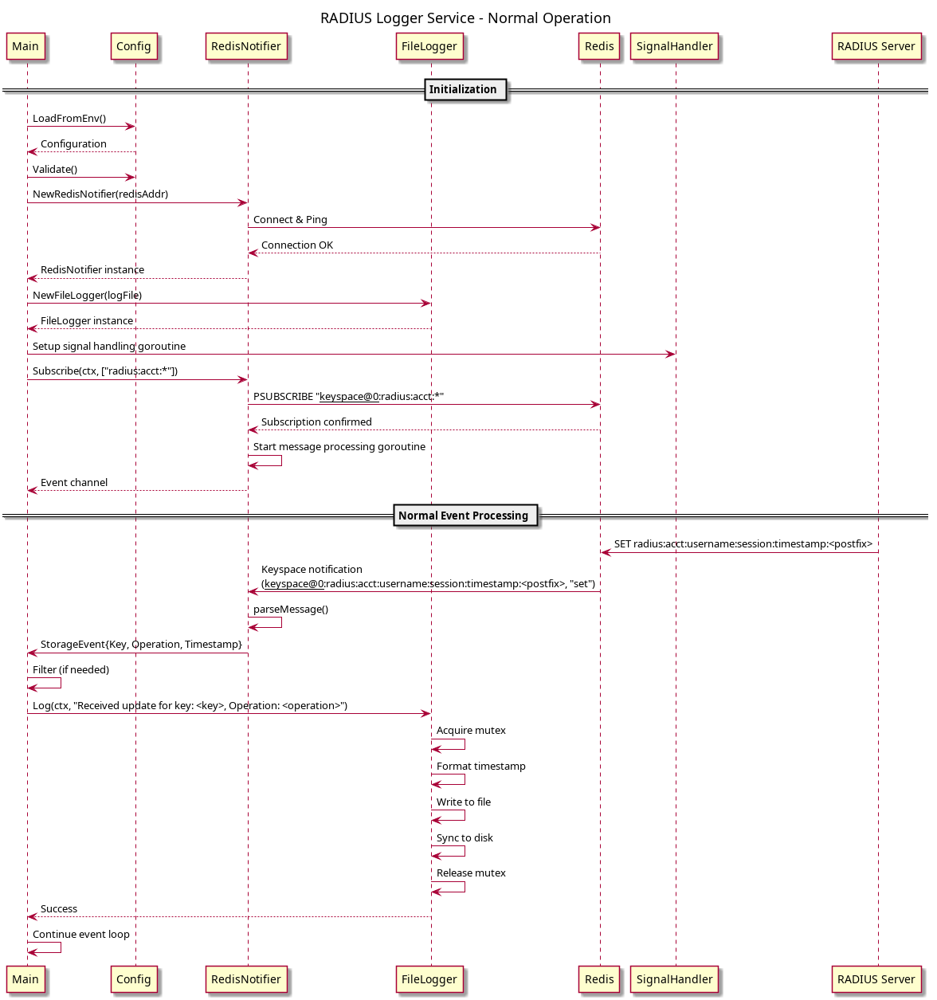

# RADIUS Accounting Server - Architecture & Design

## Table of Contents
- [Overview](#overview)
- [System Architecture](#system-architecture)
- [Component Design](#component-design)
- [Interface Design](#interface-design)
- [Data Flow](#data-flow)
- [Sequence Diagrams](#sequence-diagrams)
- [Deployment Architecture](#deployment-architecture)
- [Design Decisions](#design-decisions)
- [Technical Considerations](#technical-considerations)
- [Conclusion](#conclusion)

## Overview

The RADIUS Accounting Server is a monitoring and data collection system designed to receive mirrored RADIUS accounting traffic, store it for analysis, and provide real-time notifications of accounting events. The system follows a microservices architecture with clear separation of concerns and database-agnostic interfaces.

### Key Requirements Addressed
- Process RADIUS Accounting-Request packets (RFC 2866)
- Store accounting data in Redis with configurable TTL
- Real-time notification system using Redis keyspace events
- Persistent logging of all accounting activities
- Containerized deployment with Docker Compose
- Testing capabilities with radclient integration

## System Architecture

### High-Level Architecture


The system consists of four main containerized services that work together to process, store, and log RADIUS accounting events. The architecture follows a microservices pattern with clear separation between the RADIUS protocol handler, data storage, event notification, and testing components.

### Component Overview

1. **radius-controlplane**: Receives and processes RADIUS packets
2. **redis**: Provides storage and pub/sub messaging
3. **redis-controlplane-logger**: Subscribes to events and logs them
4. **radclient-test**: Testing and simulation container

## Component Design


### radius-controlplane

**Responsibilities:**
- Listen on UDP port 1813 for RADIUS Accounting packets
- Validate packet integrity using shared secret
- Extract accounting attributes using layeh/radius library
- Store accounting records in Redis with TTL
- Send RADIUS Accounting-Response packets

**Key Components:**
- RADIUS Handler: Packet processing logic
- Storage Interface: Database abstraction layer
- Redis Client: Concrete storage implementation

**Implementation Details:**
- Uses `layeh.com/radius` library for RADIUS protocol handling
- Implements graceful shutdown via context cancellation
- Always sends Accounting-Response even if storage fails (protocol compliance)

### redis-controlplane-logger

**Responsibilities:**
- Subscribe to Redis keyspace notifications
- Convert Redis events to application events
- Log accounting activities to persistent storage
- Handle connection failures gracefully

**Key Components:**
- Subscriber Handler: Event processing coordination
- Notifier Interface: Event subscription abstraction
- Log Interface: Logging abstraction
- File Logger: Persistent file-based logging

**Implementation Details:**
- Subscribes to pattern `radius:acct:*` via Redis keyspace notifications
- Uses buffered channels (100 events) for backpressure control
- Thread-safe file writing with mutex locks
- Syncs writes to disk for durability

### Architecture Patterns Used

- **Interface Segregation**: Small, focused interfaces (Storage, Notifier, Logger)
- **Dependency Injection**: Interfaces injected into components
- **Repository Pattern**: Storage interface abstracts data access
- **Publisher-Subscriber**: Redis keyspace notifications for event distribution
- **Graceful Degradation**: System continues operation despite storage failures

## Interface Design

### Storage Interface (Database Abstraction)

```go
type Storage interface {
    Store(ctx context.Context, record *AccountingRecord) error
    HealthCheck(ctx context.Context) error
    Close() error
}
```

**Design Rationale:**
- **Database Independence**: Can swap Redis for PostgreSQL, MongoDB, etc.
- **Context Support**: Enables timeouts and cancellation
- **Health Monitoring**: Supports service health checks
- **Resource Management**: Proper cleanup with Close()

**Current Implementation**: `RedisStorage` in `internal/storage/redis.go`

### Notifier Interface (Event System)

```go
type Notifier interface {
    Subscribe(ctx context.Context, patterns []string) (<-chan StorageEvent, error)
    Unsubscribe(patterns []string) error
    HealthCheck(ctx context.Context) error
    Close() error
}

type StorageEvent struct {
    Key       string
    Operation string
    Timestamp time.Time
}
```

**Design Rationale:**
- **Generic Events**: Not tied to Redis-specific messages
- **Rich Context**: Events include key, operation type, and timestamp
- **Channel-Based**: Non-blocking, concurrent event processing
- **Pattern Flexibility**: Support multiple subscription patterns

**Current Implementation**: `RedisNotifier` in `internal/notifier/redis.go`

### Logger Interface (Output Abstraction)

```go
type Logger interface {
    Log(ctx context.Context, message string) error
    Close() error
}
```

**Design Rationale:**
- **Output Independence**: File, syslog, or remote logging
- **Context Support**: Enables cancellation and timeouts
- **Simple API**: Easy to implement and test

**Current Implementation**: `FileLogger` in `internal/logger/file.go`

## Data Flow


### RADIUS Packet Processing Flow

1. **Packet Reception**: UDP packet arrives on port 1813
2. **Validation**: Verify shared secret and packet integrity (handled by layeh/radius)
3. **Attribute Extraction**: Parse RADIUS attributes to `AccountingRecord` struct
4. **Storage**: Store record in Redis with generated key and TTL
5. **Response**: Send RADIUS Accounting-Response
6. **Notification**: Redis auto-publishes keyspace notification

### Event Processing Flow

1. **Keyspace Notification**: Redis publishes `__keyspace@0__:radius:acct:*`
2. **Event Conversion**: Notifier converts to `StorageEvent`
3. **Event Distribution**: Event sent via channel to subscriber
4. **Logging**: Subscriber formats and logs event to file

### Data Structures

**AccountingRecord** (stored in Redis as JSON):

```go
type AccountingRecord struct {
    Username         string        `json:"username"`
    NASIPAddress     string        `json:"nas_ip_address"`
    NASPort          int           `json:"nas_port"`
    AcctStatusType   AccRecordType `json:"acct_status_type"`
    AcctSessionID    string        `json:"acct_session_id"`
    FramedIPAddress  string        `json:"framed_ip_address"`
    CallingStationID string        `json:"calling_station_id"`
    CalledStationID  string        `json:"called_station_id"`
    Timestamp        string        `json:"timestamp"`
    ClientIP         string        `json:"client_ip"`
    PacketType       string        `json:"packet_type"`
}
```

**Redis Key Format**:
```
radius:acct:{username}:{acct_session_id}:{timestamp}
```

Example:
```
radius:acct:testuser:session12345:2024-01-15T10:30:45.123456789Z
```

## Sequence Diagrams

### System-Level Packet Processing


This diagram shows the complete flow from when a RADIUS packet arrives until it's logged to disk, including error handling scenarios.

### Logger Service - Normal Operation



Shows the initialization sequence and normal event processing loop for the subscriber service.

### Logger Service - Graceful Shutdown


Demonstrates how the logger service handles SIGINT/SIGTERM signals and performs clean resource cleanup.

## Deployment Architecture


The deployment uses Docker Compose to orchestrate four containers on a single Docker host:

- **radius-controlplane**: Exposes UDP port 1813, connects to Redis
- **redis**: Redis 7 Alpine with keyspace notifications enabled
- **redis-controlplane-logger**: Connects to Redis, writes to volume-mounted log file
- **radclient-test**: Testing container with freeradius-utils

All containers communicate via a custom bridge network (`radius-network`). Redis data persists via named volume, and logs persist via host volume mount.

## Design Decisions

### 1. Database-Agnostic Interfaces

**Decision**: Use generic interfaces instead of Redis-specific APIs

**Rationale:**
- **Flexibility**: Easy to change storage backends (PostgreSQL, MongoDB)
- **Testability**: Mock interfaces for unit testing without Redis
- **Maintenance**: Easier to update implementations independently
- **Reusability**: Interfaces can be used in other projects

**Trade-off**: Slight performance overhead vs. flexibility and maintainability

### 2. Channel-Based Event System

**Decision**: Return channels from `Subscribe()` instead of callbacks

**Rationale:**
- **Control Flow**: Caller controls processing loop and can break at any time
- **Concurrency**: Natural Go concurrency patterns with select statements
- **Backpressure**: Buffered channels provide flow control (100-event buffer)
- **Cancellation**: Context cancellation works naturally with channel selects

**Trade-off**: More complex implementation vs. better control and Go idiomatic patterns

### 3. Always Send RADIUS Response

**Decision**: Send Accounting-Response even if Redis storage fails

**Rationale:**
- **RADIUS Protocol Compliance**: RFC 2866 requires responses
- **Prevents Client Timeouts**: NAS devices expect responses
- **Separation of Concerns**: Storage failures shouldn't block protocol flow
- **Graceful Degradation**: System remains operational even with storage issues

**Implementation**: Error handling logs storage failures but doesn't prevent response transmission.

### 4. Separate Logger Service

**Decision**: Create independent subscriber service instead of logging in main server

**Rationale:**
- **Separation of Concerns**: RADIUS server focuses on protocol, logger focuses on persistence
- **Independent Scaling**: Can scale logger separately if log volume increases
- **Fault Isolation**: Logger crashes don't affect RADIUS packet processing
- **Flexibility**: Can add multiple subscribers for different purposes (metrics, analytics, etc.)

**Trade-off**: Additional service complexity vs. better modularity


## Technical Considerations

### Error Handling

- **Storage Failures**: Logged but don't block RADIUS responses
- **Redis Connection Failures**: Handled gracefully with health checks
- **Context Cancellation**: Clean shutdown for all goroutines
- **Parse Errors**: Invalid packets logged with details
- **Validation Errors**: Rejected packets logged with reasons

### Performance

- **Buffered Channels**: 100-event buffer prevents blocking on slow consumers
- **Single Goroutine per Subscription**: Minimal resource usage
- **Redis Context Timeouts**: 5-second timeout prevents hanging operations
- **Connection Pooling**: Redis client uses connection pool internally

### Concurrency Safety

- **Thread-Safe Logging**: Mutex protects file writes
- **Race Detection**: All tests run with `-race` flag
- **Channel Ownership**: Clear ownership prevents data races
- **Context Propagation**: Proper context usage throughout

### Security

- **RADIUS Shared Secret**: Minimum 8 characters, validated at startup
- **Input Validation**: All extracted attributes validated before storage
- **No Secrets in Logs**: Sensitive data not logged

### Observability

- **Structured Logging**: Consistent log format with timestamps
- **Health Checks**: Both services implement health check methods
- **Connection Status**: Redis connectivity verified at startup
- **Storage Confirmation**: Successful storage logged with Redis key

## Conclusion

This architecture provides the foundation for a production-ready RADIUS accounting system with the following key benefits:

1. **Modularity**: Clear separation of concerns with well-defined interfaces
2. **Flexibility**: Database-agnostic design enables easy technology swaps
3. **Reliability**: Robust error handling and graceful degradation
4. **Maintainability**: Clean code structure with comprehensive testing
5. **Scalability**: Stateless design allows horizontal scaling (v2 roadmap)
6. **Observability**: Comprehensive logging and health checks

The interface-based architecture makes it straightforward to extend the system with additional storage backends, notification channels, or logging destinations without modifying core business logic.

### Future Considerations (v2)

- To use Yandexs stress test
- PostgreSQL storage backend implementation
- Message queue integration (Kafka/RabbitMQ)
- Distributed tracing with OpenTelemetry
