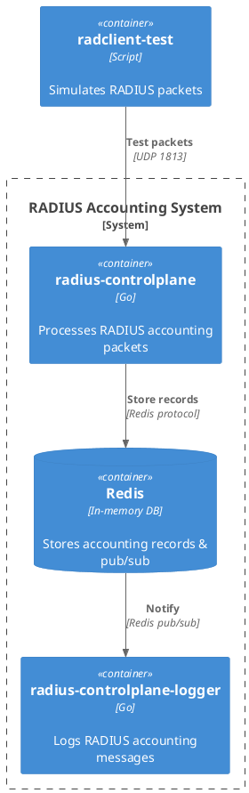

# Architecture Diagram
    

```plantuml
@startuml architecture
!include <C4/C4_Container>

System_Boundary(system, "RADIUS Accounting System") {
    Container(radius, "radius-controlplane", "Go", "Processes RADIUS accounting packets")
    Container(subscriber, "radius-controlplane-logger", "Go", "Logs RADIUS accounting messages")
    ContainerDb(redis, "Redis", "In-memory DB", "Stores accounting records & pub/sub")
}

Container(radclient, "radclient-test", "Script", "Simulates RADIUS packets")

Rel(radclient, radius, "Test packets", "UDP 1813")
Rel(radius, redis, "Store records", "Redis protocol")
Rel(redis, subscriber, "Notify", "Redis pub/sub")

@enduml
```

