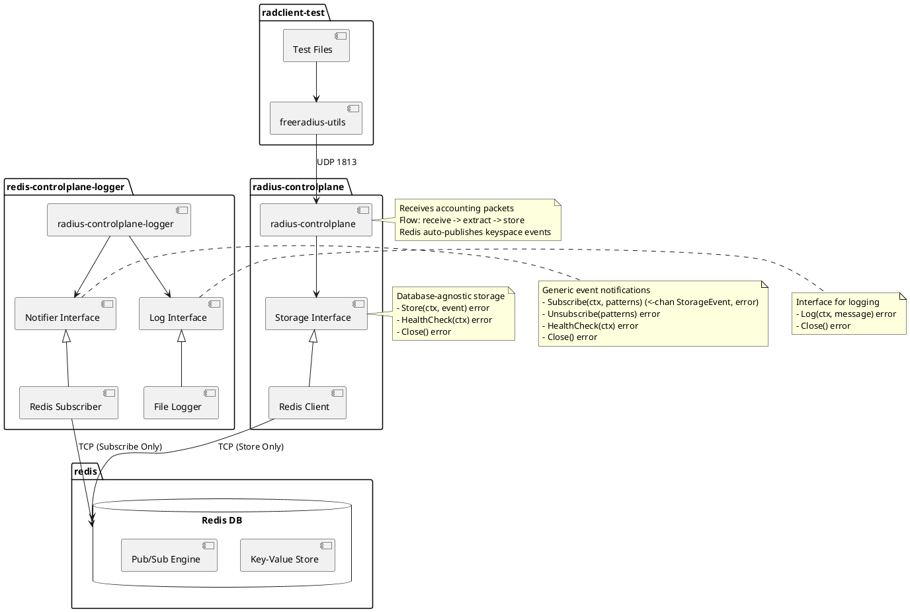

# RADIUS Accounting Server - Component Design

## Component Diagram

This component diagram reflects the current (v2) implementation of the RADIUS accounting system. The `radius-controlplane` service parses incoming packets into strongly typed `AccountingEvent` objects and stores them via the `Storage` interface. Note that the `Store` method now accepts an `event` rather than a (v1)`record` and that keys generated in Redis are postfixed with `start:`, `stop:` or `interim:` depending on the accounting event type.