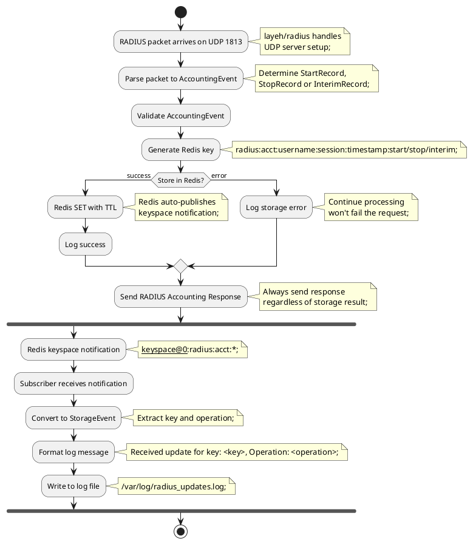

# Data Flow Diagram

This data‑flow diagram updates the original to account for the new `AccountingEvent` model.  Instead of creating a single `AccountingRecord` (v1), the server parses each incoming RADIUS packet into a specific event type (`StartRecord`, `StopRecord` or `InterimRecord`). The generated Redis key is postfixed with `start:`, `stop:` or `interim:` accordingly.