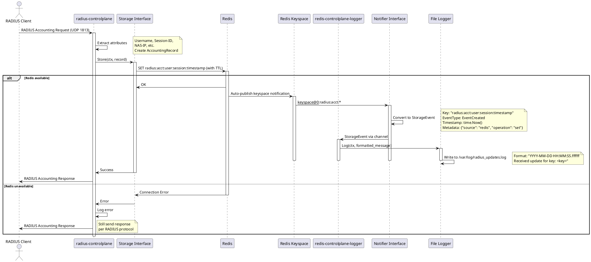
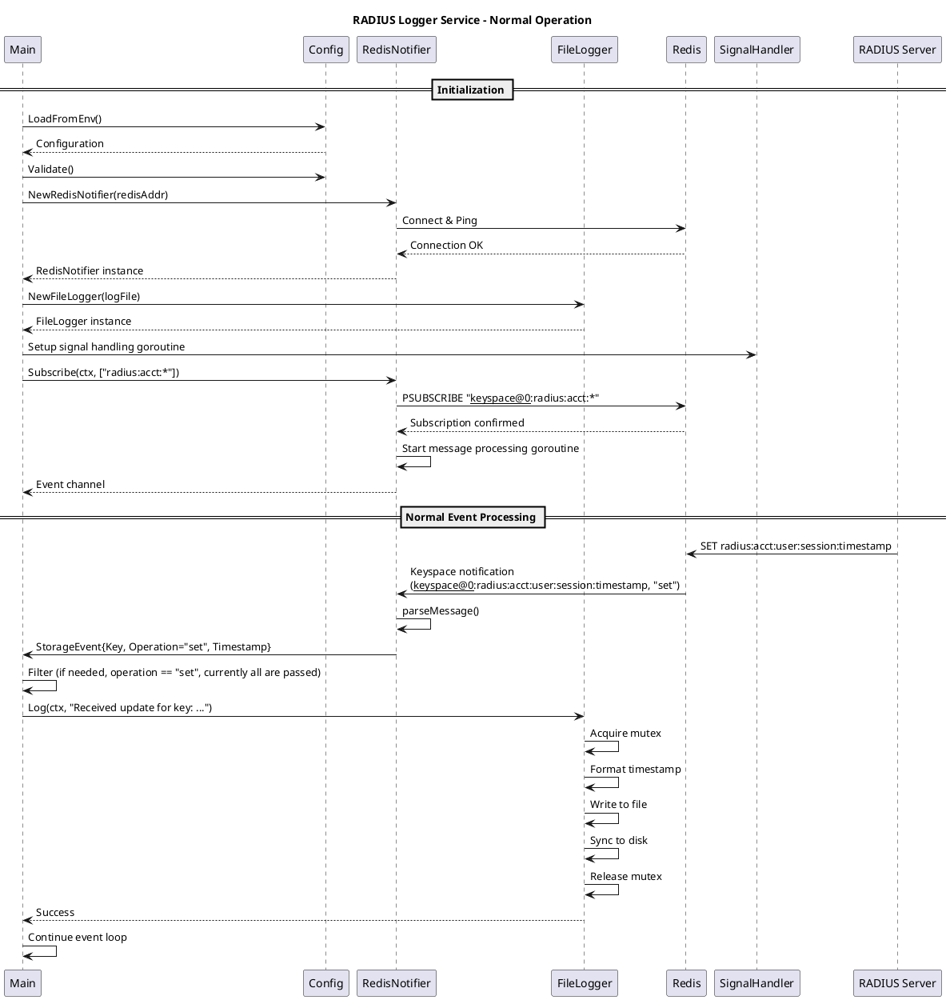
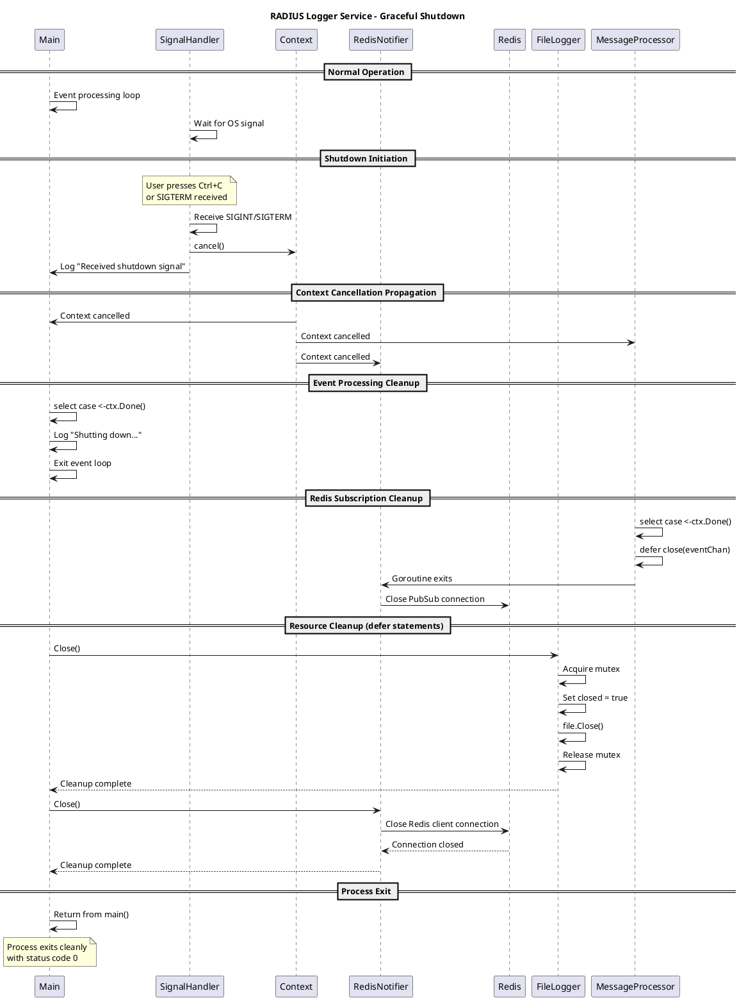

# System-level Sequence Diagram

```plantuml
@startuml sequence
actor "RADIUS Client" as client
participant "radius-controlplane" as radius
participant "Storage Interface" as storage
participant "Redis" as redis
participant "Redis Keyspace" as keyspace
participant "redis-controlplane-logger" as sub
participant "Notifier Interface" as notifier
participant "File Logger" as logger

client -> radius: RADIUS Accounting Request (UDP 1813)
activate radius

radius -> radius: Extract attributes
note right: Username, Session-ID,\nNAS-IP, etc.\nCreate AccountingRecord

radius -> storage: Store(ctx, record)
activate storage

storage -> redis: SET radius:acct:user:session:timestamp (with TTL)
activate redis

alt Redis available
    redis -> storage: OK
    redis -> keyspace: Auto-publish keyspace notification
    activate keyspace
    keyspace -> notifier: __keyspace@0__:radius:acct:*
    activate notifier
    notifier -> notifier: Convert to StorageEvent
    note right: Key: "radius:acct:user:session:timestamp"\nEventType: EventCreated\nTimestamp: time.Now()\nMetadata: {"source": "redis", "operation": "set"}
    notifier -> sub: StorageEvent via channel
    activate sub
    sub -> logger: Log(ctx, formatted_message)
    activate logger
    logger -> logger: Write to /var/log/radius_updates.log
    note right: Format: "YYYY-MM-DD HH:MM:SS.ffffff\nReceived update for key: <key>"
    deactivate logger
    deactivate sub
    deactivate notifier
    deactivate keyspace
    
    storage -> radius: Success
    deactivate storage
    radius -> client: RADIUS Accounting Response
    
else Redis unavailable
    redis -> storage: Connection Error
    deactivate redis
    storage -> radius: Error
    deactivate storage
    radius -> radius: Log error
    radius -> client: RADIUS Accounting Response
    note right: Still send response\nper RADIUS protocol
end

deactivate radius
@enduml
```
# radius-controlplane-lpgger service - normal operatioon

```plantuml
@startuml logger_normal_operation
title RADIUS Logger Service - Normal Operation

participant "Main" as main
participant "Config" as config
participant "RedisNotifier" as notifier
participant "FileLogger" as logger
participant "Redis" as redis
participant "SignalHandler" as signal
participant "RADIUS Server" as radius_server

== Initialization ==
main -> config: LoadFromEnv()
config --> main: Configuration
main -> config: Validate()

main -> notifier: NewRedisNotifier(redisAddr)
notifier -> redis: Connect & Ping
redis --> notifier: Connection OK
notifier --> main: RedisNotifier instance

main -> logger: NewFileLogger(logFile)
logger --> main: FileLogger instance

main -> signal: Setup signal handling goroutine
main -> notifier: Subscribe(ctx, ["radius:acct:*"])
notifier -> redis: PSUBSCRIBE "__keyspace@0__:radius:acct:*"
redis --> notifier: Subscription confirmed

notifier -> notifier: Start message processing goroutine
notifier --> main: Event channel

== Normal Event Processing ==
radius_server -> redis: SET radius:acct:user:session:timestamp
redis -> notifier: Keyspace notification\n(__keyspace@0__:radius:acct:user:session:timestamp, "set")

notifier -> notifier: parseMessage()
notifier -> main: StorageEvent{Key, Operation="set", Timestamp}

main -> main: Filter (if needed, operation == "set", currently all are passed)
main -> logger: Log(ctx, "Received update for key: ...")
logger -> logger: Acquire mutex
logger -> logger: Format timestamp
logger -> logger: Write to file
logger -> logger: Sync to disk
logger -> logger: Release mutex
logger --> main: Success

main -> main: Continue event loop


@enduml
```
# radius-controlplane-lpgger service - shutdown sequenece

```plantuml

@startuml logger_shutdown_sequence
title RADIUS Logger Service - Graceful Shutdown

participant "Main" as main
participant "SignalHandler" as signal
participant "Context" as ctx
participant "RedisNotifier" as notifier
participant "Redis" as redis
participant "FileLogger" as logger
participant "MessageProcessor" as processor

== Normal Operation ==
main -> main: Event processing loop
signal -> signal: Wait for OS signal

== Shutdown Initiation ==
note over signal: User presses Ctrl+C\nor SIGTERM received
signal -> signal: Receive SIGINT/SIGTERM
signal -> ctx: cancel()
signal -> main: Log "Received shutdown signal"

== Context Cancellation Propagation ==
ctx -> main: Context cancelled
ctx -> processor: Context cancelled
ctx -> notifier: Context cancelled

== Event Processing Cleanup ==
main -> main: select case <-ctx.Done()
main -> main: Log "Shutting down..."
main -> main: Exit event loop

== Redis Subscription Cleanup ==
processor -> processor: select case <-ctx.Done()
processor -> processor: defer close(eventChan)
processor -> notifier: Goroutine exits
notifier -> redis: Close PubSub connection

== Resource Cleanup (defer statements) ==
main -> logger: Close()
logger -> logger: Acquire mutex
logger -> logger: Set closed = true
logger -> logger: file.Close()
logger -> logger: Release mutex
logger --> main: Cleanup complete

main -> notifier: Close()
notifier -> redis: Close Redis client connection
redis --> notifier: Connection closed
notifier --> main: Cleanup complete

== Process Exit ==
main -> main: Return from main()
note over main: Process exits cleanly\nwith status code 0


@enduml
```